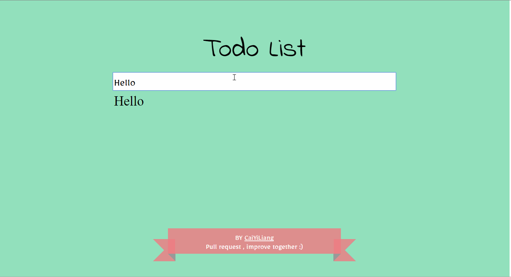

#Welcome to todolist.vue.js

## 涉及知识点 

-  <a href="https://vuejs.org/v2/guide/instance.html">Vue.js - Instance</a>
-  <a href="https://vuejs.org/v2/guide/class-and-style.html">Vue.js - Class and Style Bindings</a>
-  <a href="https://vuejs.org/v2/guide/list.html">Vue.js - List Rendering</a>
-  <a href="https://vuejs.org/v2/guide/events.html">Vue.js - Event Handling</a>
-  <a href="https://vuejs.org/v2/guide/forms.html">Vue.js - Form Input Bindings</a>
-  <a href="http://www.w3schools.com/html/html5_intro.asp">HTML5</a>
-  <a href="http://www.w3schools.com/css/css3_intro.asp">CSS3</a>

## Demo  展示

## Todo Features
-  Todo item 数目显示和统计
-  优化现有js代码(提示：data属性)
-  在todoApp中应用<a href="https://vuejs.org/v2/guide/transitions.html">vue-Transition Effects</a>
-  优化width:400px的响应式页面(@media query)

## 最后的最后
-  请尽情pull request(不会( ⊙ o ⊙ )啊！Google first)以及raise issue(不会( ⊙ o ⊙ )啊！Google first) ,
   共同进步O(∩_∩)O！
-  todolist.vue.js将针对以上Todo Features在<a href="https://github.com/CaiYiLiang/TodoList">我的Github-todolist</a>上更新，感兴趣的小伙伴欢迎来看。
